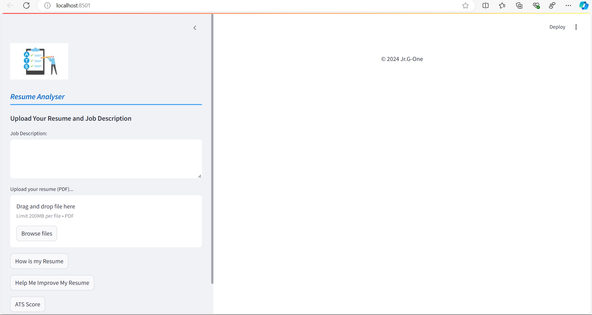
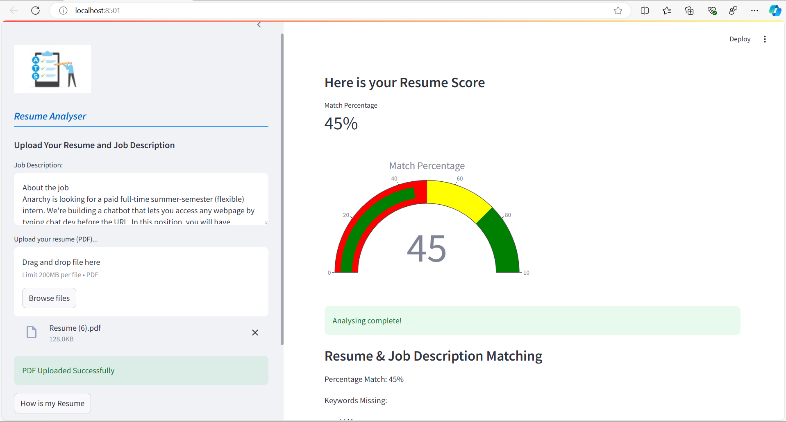

# 🌟 Your Resume Expert 🌟


Welcome to **Your Resume Expert**! This application analyzes your resume against job descriptions, provides insights, and helps you improve your resume to match job requirements better. 🚀

## ⚠️ Prerequisites

1. **Poppler must be installed on your OS**
   - Download Poppler binaries suitable for your operating system from [Poppler's official website](https://poppler.freedesktop.org/).
   - Extract and place the Poppler binaries (e.g., `pdftoppm`, `pdfinfo`) into a folder within your project directory (e.g., `bin`).

2. **Create a Google API Key**
   - Generate your own API key from the [Google Cloud Console](https://console.cloud.google.com/).
   - Enable the Google Generative AI API for your project.

## 🛠️ Installation

1. Clone the repository:

   ```bash
   git clone https://github.com/JrG-One/Resume_ATS.git
   cd your-resume-expert
   ```

2. Create and activate a virtual environment:

   ```bash
   python -m venv venv
   source venv/bin/activate  # On Windows: venv\Scripts\activate
   ```

3. Install the required packages:

   ```bash
   pip install -r requirements.txt
   ```

4. Create a .env file in the project directory and add your Google API Key and Poppler path:

   ```bash
   # .env file contents
   GOOGLE_API_KEY=your_google_api_key
   POPPLER_PATH="./bin"  # or the path where you placed your Poppler binaries
   ```

## 🚀 Running the Application

To start the Streamlit application, run:

```bash
streamlit run app.py
```

## 🎨 Features

- **Resume Analysis**: Extract technical skills, soft skills, and important information from your resume.
- **Improvement Suggestions**: Identify missing keywords and skills, and get suggestions to enhance your resume.
- **ATS Score**: Evaluate your resume against job descriptions with a percentage match score and visual feedback.

## 🖼️ Screenshots





## 📝 How to Use

1. **Upload Your Resume**: In PDF format.
2. **Enter Job Description**: Paste the job description in the provided text area.
3. **Analyze and Improve**: Click on the buttons to get resume analysis, improvement suggestions, and ATS score.

## 🛠️ Technologies Used

- **Streamlit**: For the web interface.
- **Python**: Core programming language.
- **PDF2Image**: To convert PDF to images.
- **PIL**: To handle image processing.
- **Google Generative AI**: For generating content based on your resume and job description.
- **Plotly**: For creating beautiful gauge charts.

## 👨‍💻 Author

**Jr, G-One**

- [GitHub](https://github.com/JrG-One)
- [LinkedIn](https://www.linkedin.com/in/ojaswavarshney/)

## 🌟 Acknowledgments

- Special thanks to the developers of [Streamlit](https://streamlit.io/), [pdf2image](https://github.com/Belval/pdf2image), [PIL](https://pillow.readthedocs.io/), and [Plotly](https://plotly.com/python/) for their awesome libraries.